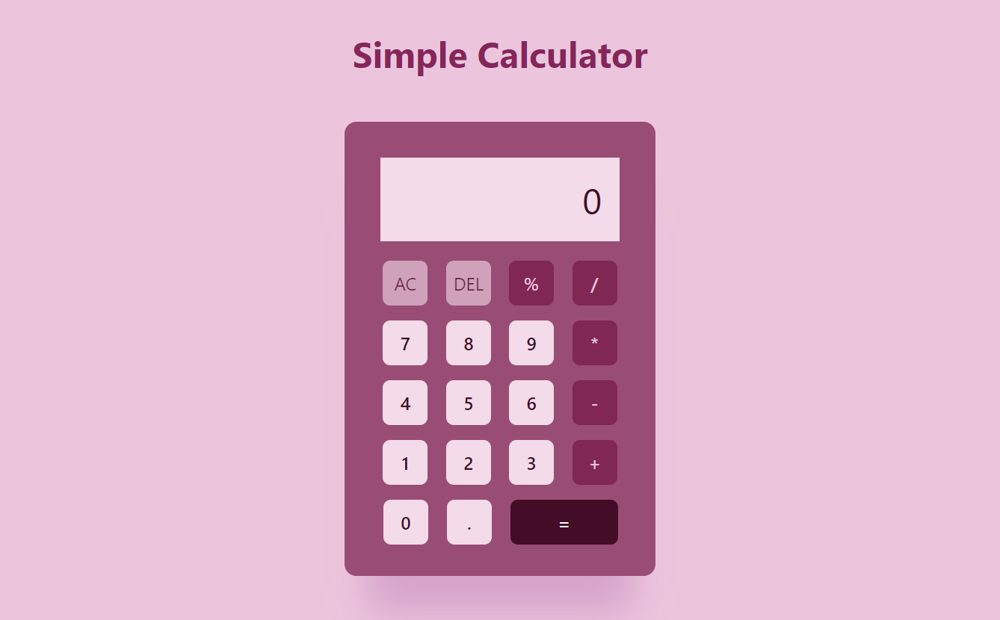

# SIMPLE CALCULATOR

   

## Description

 
This is a simple calculator that will allow user to perform simple operations like : addition, subtraction, multiplication, division and finding out percentage of a number.
   

## Features

 
--> Sleek, simple design resembling an actual calculators
 
--> Hover button effects giving visually appealing look
 
--> Allow continuous operations i.e allows user to perform further operations on the obtained result (if needed)
   

## Technologies Used

 
Outline the technologies you used to build the landing page:
 
--> HTML5
 
--> CSS3
 
--> JavaScript
   

## Credits

 
--> Coolors for generating customized palette
  
--> MDN docs and Youtube for added assistance

## License

 
This project belongs solely to the author

## Screenshots

   

