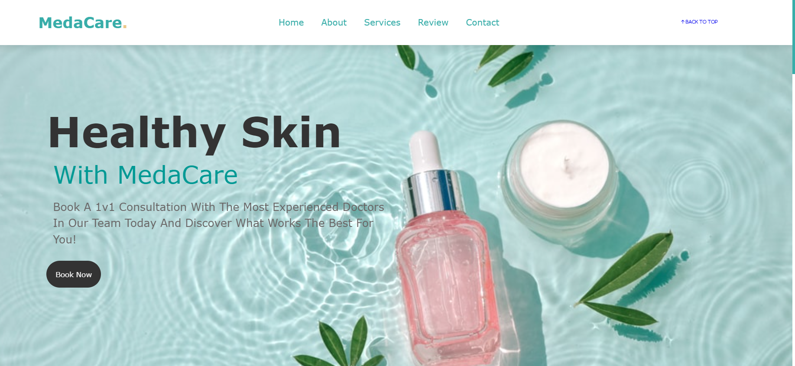

# LANDING PAGE

   

## Description

 
This is a landing page for a skin healthcare company - MedaCare(fictional). It provides 1v1 consultation directly from MedaCare's highly qualified skin specialists which makes the exchange between patients and their supervisor seamless.
   

## Features

 
--> Responsive navbar guiding user to different sections of the page.
 
--> AOS used for a appealing and user-friendly design.
 
--> Footer section with social media links of MedaCare.
 
--> Responsive design for various screen sizes achieved with the help of <strong>Media Queries</strong>.
   

## Technologies Used

 
--> HTML5
 
--> CSS3
   

## Credits

 
-->FontAwesome for icons and AOS.
 
--> Coolors for generating customized palette.
  
--> Pinterest and Google for background pictures.
  
-->Canva for designing logo for MedaCare.

## License

 
This project belongs solely to the author

## Screenshots

   

