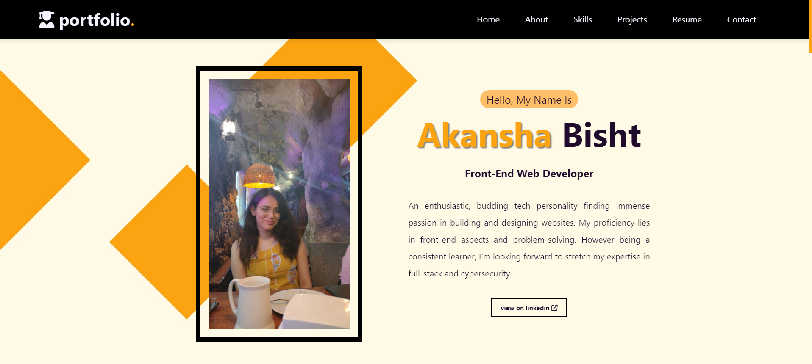

# PERSONAL PORTFOLIO

   

## Description

 
This is a single page personal portfolio website cosnisting of the following sections :
 
1. Navbar : To help walk through different sections.
 
2. Home : My picture + brief introduction + link redirecting to my linkedin profile.
 
3. About : Introductory section including details about my education and experiences.
 
4. Skills : Mentioning my skills and area of expertise.
 
5. Projects : A section to showcase my projects + link redirecting to my github profile.
 
6. Resume and Certifications : Download my resume from this sections + view all my certifications and achievements.
 
7. Contact : Get my contact, email and location details.
 
8. Footer : Credits and link to my social accounts.
   

## Features

 
--> Responsive navbar guiding user to different sections of the page.
 
--> AOS used for a appealing and user-friendly design.
 
--> Footer section with social media links.
 
--> Responsive design for various screen sizes achieved with the help of <strong>Media Queries</strong>.
 
--> Download button for Resume.
 
--> Certificates displayed using image slider with captions.
   

## Technologies Used

 
--> HTML5
 
--> CSS3
   

## Credits

 
-->FontAwesome for icons and AOS.
 
--> Coolors for generating customized palette.
  
--> Pexels and Heikei for background pictures.
  
-->Flaticons for more icons.

## License

 
This project belongs solely to the author

## Screenshots

   

